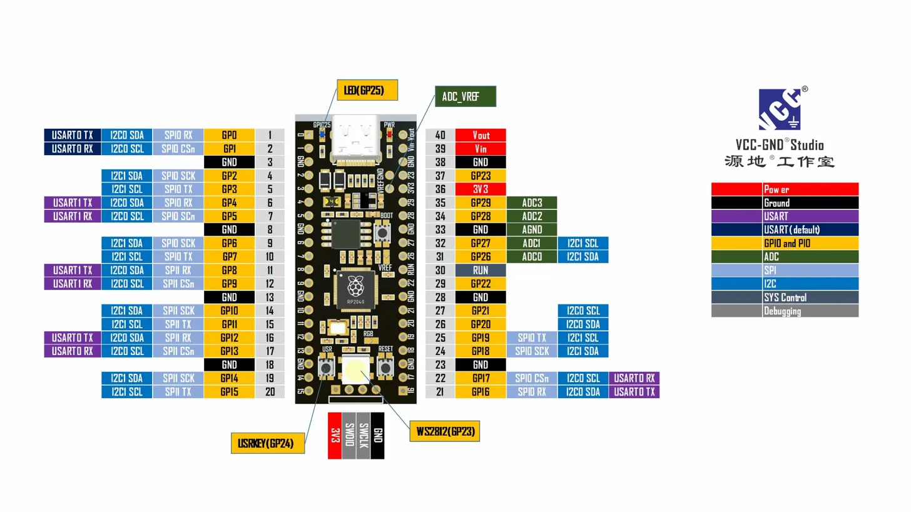

# MicroPython for YD-RP2040 (16MB Flash)

Custom MicroPython firmware for the **YD-RP2040** development board by VCC-GND Studio, featuring 16MB of flash storage.

---

## 📋 About This Board

The YD-RP2040 is a Raspberry Pi Pico-compatible board with enhanced features.

| Feature | Raspberry Pi Pico | YD-RP2040 |
|---------|-------------------|-----------|
| Flash Storage | 2MB | **16MB** |
| Filesystem Space | ~1MB | **~15MB** |
| USB Connector | Micro USB | **USB-C** |
| NeoPixel RGB LED | ❌ | **GPIO23** |
| User Button | ❌ | **GPIO24** |
| Reset Button | ❌ | **✅** |

---

## ⚠️ NeoPixel Solder Bridge

Some boards ship with the NeoPixel disconnected. If it doesn't work, bridge the pads labeled **"R58"** near the LED with solder.

---

## 🔌 Pinout

**On-board components:**
- GPIO23 → NeoPixel RGB LED (requires solder bridge)
- GPIO24 → USR Button (works out of the box)
- GPIO25 → Blue LED

---

## 📥 Installation

1. Download `firmware.uf2` from [Releases](../../releases)
2. Hold **BOOT** and plug in USB
3. Drag `firmware.uf2` onto the **RPI-RP2** drive
4. Connect via Thonny (select "MicroPython (Raspberry Pi Pico)" or "MicroPython (Generic)") or any serial terminal at 115200 baud

---

## 🏗️ Building

Go to **Actions** → **Build MicroPython for YD-RP2040-16MB** → **Run workflow**

Download the artifact when complete.

---

## 📚 Resources

- [MicroPython Documentation](https://docs.micropython.org/)
- [RP2040 Datasheet](https://datasheets.raspberrypi.com/rp2040/rp2040-datasheet.pdf)
- [YD-RP2040 Schematic](https://github.com/initdc/YD-RP2040)

---

## 📄 License

MIT License
